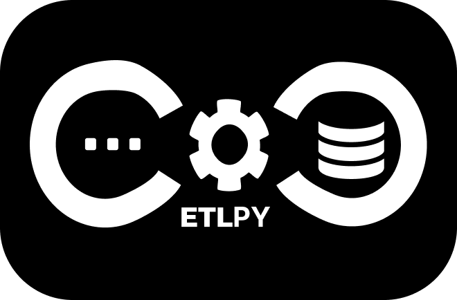
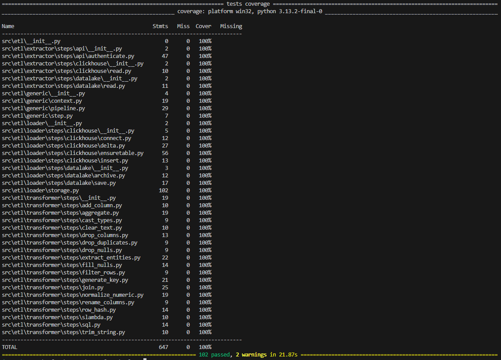

<p align="center">
  
</p>

<p align="center">
  <strong>A composable, async toolkit for building ETL pipelines in Python  powered by Polars.</strong>
</p>

<p align="center">
  
  
  
  
  
</p>

---

**ETLPY** is a small, unopinionated set of building blocks for extract / transform / load work.
You compose pipelines from tiny, single-purpose **steps** and run them - in a script or inside an Airflow task. It is a _toolkit_, not a framework: take what you need, write your own
steps for the rest.

- **Pipeline** - Just a list of async `Step`s. Add, remove, reorder.
- **Polars-native** - one engine end to end (Arrow under the hood).
- **Async** - steps are `async`, so you can fan out concurrent API/DB calls inside a step.
- **Data lake + ClickHouse** - parquet storage helpers and a ClickHouse loader are included. In future other databases.
- **Deduplication** - row-hash change detection loads only new or changed rows.
- **Airflow-friendly** - one pipeline = one task. etlpy moves the data; Airflow orchestrates.

## Installation

> Not on PyPI yet — install from source for now.

```bash
# everything
pip install -e ".[all]"

# or pick the stage you need
pip install -e ".[extractor]"     # httpx-based API steps
pip install -e ".[transformer]"   # Polars transform steps
pip install -e ".[loader]"        # ClickHouse + data lake
```

Requires Python 3.13+.

## Quick start

A pipeline threads a Polars `DataFrame` through a list of steps:

```python
import asyncio
from etl.generic import Pipeline, Pipestart
from etl.transformer.steps import ClearText, DropDuplicates, GenerateKey, RowHash
from etl.loader.steps.datalake import Save

@Pipestart
async def clean_customers(raw_df):
    return Pipeline([
        ClearText(),
        DropDuplicates(),
        GenerateKey(columns=["id"], key_name="pk"),
        RowHash(),                             # content fingerprint for change detection
        Save(name="customers", layer="raw"),   # persist to the data lake
    ], dataframe=raw_df)


asyncio.run(clean_customers(raw_df))
```

Load a lake file into ClickHouse, inserting only what actually changed:

```python
from etl.generic import Pipeline
from etl.extractor.steps.datalake import Read
from etl.loader.steps.clickhouse import EnsureTable, Delta, Insert
from etl.extractor.steps.clickhouse import Connect
from etl.loader.steps.datalake import Archive

await Pipeline([
    Connect(host="clickhouse", database="analytics"),
    Read(layer="fact", name="transactions"),
    EnsureTable("fact_transactions",
                engine="ReplacingMergeTree(loaded_at)", order_by=["pk"]),
    Delta("fact_transactions", keys=["pk"]),   # skip rows already loaded unchanged
    Insert("fact_transactions"),
    Archive(layer="fact", name="transactions"),
]).run()
```

Any step can halt the pipeline gracefully by raising `StopPipeline`. It is a
control-flow signal, not an error: `run()` stops, skips the remaining steps and
returns the data produced so far (no traceback).

```python
from etl.generic import Step, StopPipeline

class StopIfEmpty(Step):
    async def apply(self, df, data=None):
        if df is None or df.is_empty():
            raise StopPipeline("no rows")          # stop, return df as-is
        return df
```

Pass `df=` to control what the pipeline returns on stop:

```python
raise StopPipeline("threshold hit", df=partial)
```

## Core concepts

| Piece              | What it is                                                                                                                                                                      |
| ------------------ | ------------------------------------------------------------------------------------------------------------------------------------------------------------------------------- |
| **`Pipeline`**     | An ordered list of steps. `run()` threads a DataFrame through them and returns the final one.                                                                                   |
| **`StopPipeline`** | A step may raise StopPipeline to halt the run early                                                                                                                             |
| **`Pipestart`**    | A decorator that runs a pipeline-returning function.                                                                                                                            |
| **`Step`**         | A unit of work: `async def apply(self, df, data) -> df`. Write your own by subclassing.                                                                                         |
| **`Data`**         | A shared context (auth tokens, DB clients, config) passed to every step. Mutated by reference; **DataFrames don't live here** - they flow as the threaded `df` or via the lake. |

The split is deliberate: the **`DataFrame`** is threaded and returned, while the **`Data`** context is
shared state. Heavy tables move through the data lake, not through the context - which keeps each
pipeline a clean fit for a single Airflow task.

## The toolbox

Every step is one small class with an `async def apply(self, df, data) -> df`. Below is the full set.
Missing one? Subclass `Step`, implement `apply`, and drop it into the list.

### Extract

- **`OAuthenticate(url, credentials, fields=OAuthFields(...), send="json", method="POST", auth_header=None, headers=None, store="auth", timeout=60.0)`** - non-interactive OAuth 2.0 token flow (client-credentials). Sends `credentials` (JSON or form via `send`), pulls the token out of the response by dotted paths (`fields`), applies `auth_header` (e.g. `{"Authorization": "Bearer {token}"}`, `{token}` is filled in) to the shared httpx client, and stores the parsed auth in `data["auth"]`. Request-level headers (gateway API keys, `Content-Type`) go in `headers`.
- **`AuthenticateBasic(user, password, headers=None, timeout=60.0)`** _(HTTP Basic, RFC 7617)_ - sets `httpx.BasicAuth(user, password)` on the shared client so every downstream request carries `Authorization: Basic ...`. No token exchange - the header is static.
- **`Read(layer, name)`** _(data lake)_ - read `{name}.parquet` from a lake layer into the pipeline df.
- **`Read(query)`** _(ClickHouse)_ - run a SQL query (client from `data["ch"]`) and return the result as a Polars frame.
- **`Connect(host, port=8123, database, username, password, secure=False)`** _(ClickHouse)_ - open a clickhouse-connect client (extra kwargs are forwarded) and store it in `data["ch"]`.

> **`OAuthFields`** maps where each token-response field lives, e.g.
> `OAuthFields(access_token="data.access_token", expires_in="data.expires_in")`.
> Set a field to `None` if the API does not return it.

### Transform

- **`AddColumn(column_name, value)`** - add a constant-value column.
- **`CastTypes({column: dtype})`** - cast columns to Polars dtypes (pin types before loading).
- **`RenameColumns({old: new})`** - rename columns.
- **`DropColumns(columns, exclude=False)`** - drop the listed columns; `exclude=True` keeps only them.
- **`DropDuplicates(subset=None)`** - drop duplicate rows (by `subset`, or all columns).
- **`DropNulls(subset=None)`** - drop rows with a null in any of `subset`.
- **`FillNulls(value, columns=None)`** - fill nulls; `value` is a scalar or a `{column: value}` dict.
- **`FilterRows(expr)`** - keep rows matching a Polars boolean expression, e.g. `pl.col("amount") > 0`.
- **`TrimString(columns=None)`** - strip whitespace from string columns (`None` / `"*"` = all string columns).
- **`ClearText(columns="*")`** - clean text: collapse newlines to spaces, drop quotes/backslashes, trim.
- **`NormalizeNumeric(columns, method="minmax")`** - scale numeric columns (`"minmax"` or `"zscore"`).
- **`GenerateKey(columns, key_name="pk", mode="hash")`** - build a key column. `mode`: `"hash"` (SHA-256 hex), `"hash_int"` (stable 64-bit int), `"sequential"` (1, 2, 3, ...).
- **`RowHash(exclude=None, separator="||")`** - SHA-256 fingerprint of every row value (minus `row_hash`, `loaded_at`, and `exclude`) written to `row_hash`, for change detection.
- **`Aggregate(group_by, aggregations)`** - group + aggregate, e.g. `{"amount": ["sum", "mean"]}`; output columns are `{column}_{func}`.
- **`Join(other, on, how="inner", select=None, prefix=None)`** - join with another frame **or a sub-`Pipeline`** (run to produce the right side); `select` / `prefix` shape the right columns.
- **`ExtractEntities(sources, defaults=None)`** - stack several column groups into one long table (e.g. sender/receiver columns into a single `party` table).
- **`SQL(query, view_name="source")`** - run a Polars-SQL query over the df (registered as `view_name`); `SQL.from_file(path)` loads the query from a `.sql` file.
- **`Lambda(func)`** - apply an arbitrary `df -> df` callable (escape hatch for one-off logic).

### Load

- **`EnsureTable(table, order_by, engine="MergeTree", partition_by=None, if_exists="append")`** - create `table` from the df schema if it does not exist. `order_by` is required (it is the primary / dedup key); `if_exists="error"` raises when the table already exists.
- **`Delta(table, keys)`** - keep only new or changed rows by comparing `row_hash` against the table (needs a `ReplacingMergeTree`-family engine). The core of idempotent loads.
- **`Insert(table)`** - insert the df into a ClickHouse table via Arrow (an empty / `None` frame is skipped).
- **`Save(name, layer="raw")`** _(data lake)_ - write the df to a lake layer as `{name}.parquet`, overwriting in place.
- **`Archive(layer, name)`** _(data lake)_ - move a lake file into the `archive` layer (e.g. after a successful load).

## Testing

Every step has its own unit tests, and the whole extract / transform / load chain is exercised end to
end against a real ClickHouse (spun up in Docker via `testcontainers`). A complete pipeline example
lives in [`generic/tests/test_pipeline.py`](src/etl/generic/tests/test_pipeline.py).

```bash
pip install -e ".[all,test]"
pytest -q
```

<p align="center">  </p>

## Status

Alpha, under active development. A PyPI release is planned.

## License

Released under the [MIT License](LICENSE).
